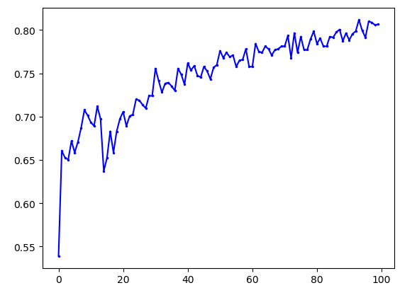

# Deep Learning to predicate PM 10, 2.5 of China(Beijing) and South Korea(Seoul).

## Deep Learning PM 10
   * A simple Neural networks model
   * changechina4567seoul7 is China's PM2.5 Data (2014~2017) with Korea's PM10 Data(2017) 
   * I can't found China's PM10 Data so I used PM2.5 Data 
   * Korea PM10 Data was from http://cleanair.seoul.go.kr/main.htm
   * China PM2.5 Data was from http://www.stateair.net/web/historical/1/1.html
  
## GETTING STARTED:
  * To compile the project on your own machine follow this steps:
  
  1. Open DeepLearning-PM10.py
  
  2. Just run Python.
  
  3. You can change file between seouldata134567.svc and changechina4567seoul7.svc
  ex) seouldata134567.svc can predict 2017 data by Learning 2013~2016
  
  4. Using this, you can guess China's air condition influence on Korea
  ex) Compare China 14~17 with predict Seoul 17 to china 14~17 with predict Seoul 17
  (You have to make 2days term, that is moving time of PM10 from Beijing China to Seoul Korea)
  
  

## SOFTWARE REQUIREMENTS FOR COMPILING:
  * OS: Windows 7/8/10
  * Python 3.6

## LICENSE:
  * https://github.com/astral2156

